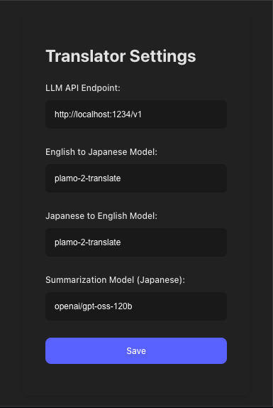
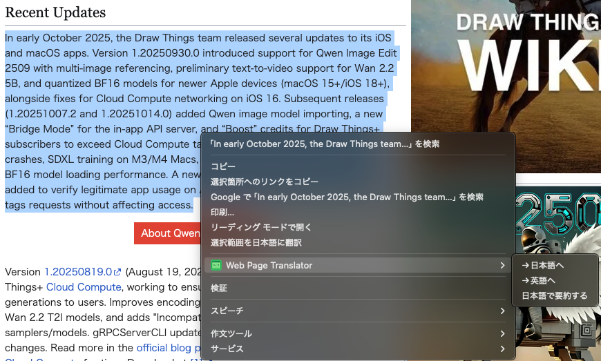

# Web Page Translator

This is a Chrome extension that translates selected text on a web page using a self-hosted or local Large Language Model (LLM).

## Features

- **Text Translation**: Select any text on a webpage and translate it via the context menu.
- **Side Panel Display**: The translation result is displayed in the browser's side panel.
- **Custom LLM Endpoint**: Configure the API endpoint of your own LLM through the options page.
- **Dark/Light Mode UI**: The options page supports both dark and light color schemes.

## Tech Stack

- **Manifest V3**: The latest standard for Chrome extensions.
- **TypeScript**: For type-safe JavaScript development.
- **Vite**: As the build tool for fast development and bundling.
- **Biome**: For code formatting and linting.

## Setup and Build

1.  **Clone the repository:**
    ```bash
    git clone <repository-url>
    ```

2.  **Install dependencies:**
    ```bash
    npm install
    ```

3.  **Build the extension:**
    ```bash
    npm run build
    ```
    This will create a `dist` directory with the bundled extension files.

4.  **Load the extension in Chrome:**
    - Open Chrome and navigate to `chrome://extensions`.
    - Enable "Developer mode" in the top right corner.
    - Click "Load unpacked".
    - Select the `dist` directory from this project.

## How to Use

1.  **Configure the Endpoint**: 
    - Click on the extension icon in the Chrome toolbar or go to the extension's options page.
    - Set the API endpoint for your local LLM (e.g., `http://localhost:8080/v1/chat/completions`).
    - Specify the model names for translation and summarization.
    - Click "Save".

    

2.  **Translate Text**:
    - Select any text on a web page.
    - Right-click to open the context menu.
    - Choose the translation option (e.g., "Translate English to Japanese").

    

3.  **View Result**:
    - The browser's side panel will open and display the translation result.

## Project Structure

```
.
├── dist/                # Build output directory
├── public/              # Static assets (manifest.json, icons)
├── src/
│   ├── background.ts    # Service worker for context menus and events
│   ├── content.ts       # (Not in use, for DOM manipulation)
│   ├── options.ts       # Logic for the settings page
│   ├── sidepanel.ts     # Logic for the side panel
│   └── style.css        # Global and options page styles
├── options.html         # Extension settings page
├── sidepanel.html       # Side panel UI
├── package.json         # Project dependencies and scripts
└── vite.config.ts       # Vite build configuration
```
